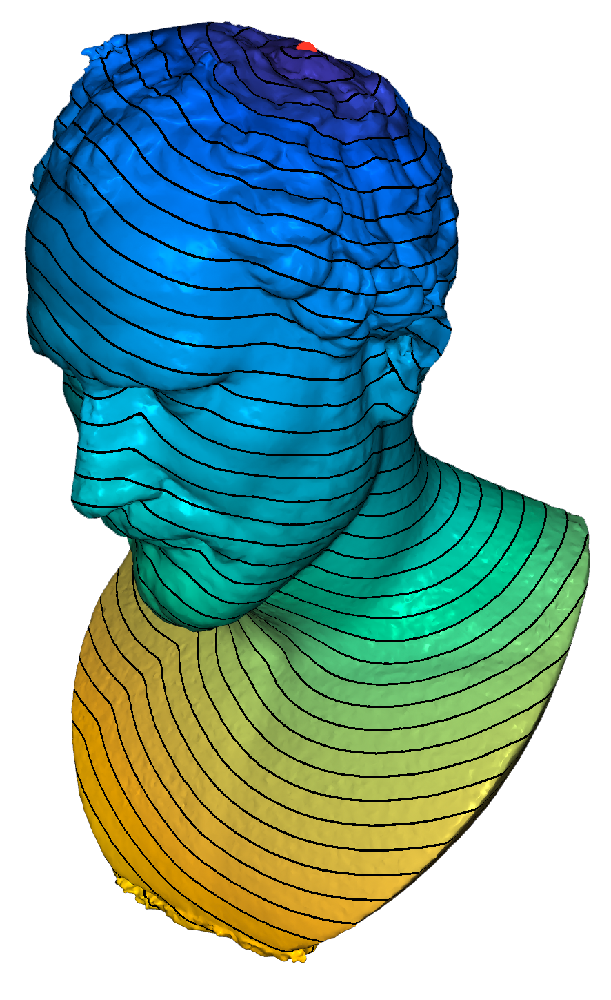
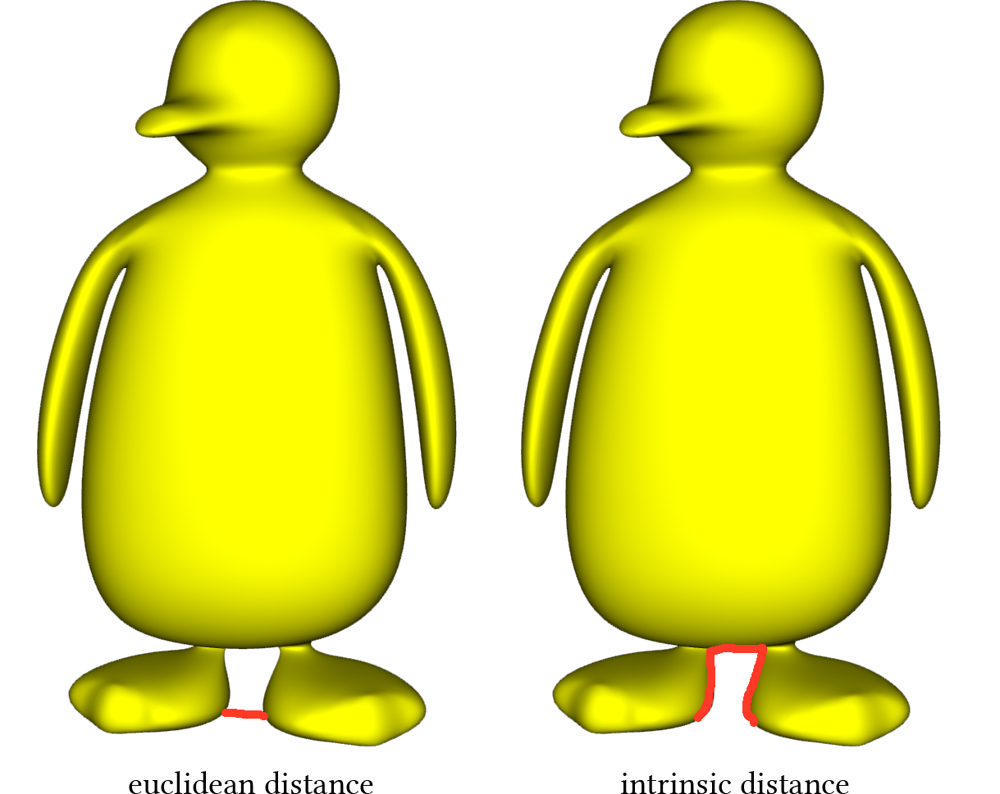

# Geometry Processing Distances

> **To get started:** Clone (**do not fork publicly**) this repository
> 
>     git clone --recursive https://github.com/odedstein/fs-2024-csci-599-exercise-9.git
>

## Installation, Layout, and Compilation

See
[introduction](https://github.com/odedstein/fs-2024-csci-599-exercise-1).

## Execution

Once built, you can execute the assignment from inside the `build/` by running
on a given mesh.

    ./distances [path to mesh.obj]

## Background

Computing distances is a task that has many applications.
It can be used to generate artistic patterns on surfaces, it can be used to
apply certain effects unequally to different parts of the surface, or it can
be used for literal engineering uses, such as measuring the distance between
two points on the surface.

The mathematical theory behind distances on surfaces is very fascinating, and
it will not be explored in detail in this assignment, but we will cover it
superficially.

In $\mathbb{R}^d$, the distance between two points $x \in \mathbb{R}^d$ and
$y \in \mathbb{R}^d$ is given by

$$
d(x,y) = \lVert x-y \rVert
\; .
$$

This does not really work for general surfaces $\Omega \subseteq \mathbb{R}^d$.
We want to compute the _intrinsic_ distance, i.e., how far two points are from
each other _within_ the surface, and not in the Euclidean space around it.

This distance within the surface, the intrinsic distance, is called
_geodesic distance_.
Geodesic distances are named after geodesics.
We will not learn what exactly a geodesic is in this exercise, but I
encourage you to read up on it [in this very accessible online encyclopedia](https://mathworld.wolfram.com/Geodesic.html).

The basic object we use to define distances is the _path_.
A path is a differentiable function $gamma : [0,1] \rightarrow \Omega$ from
the unit interval to the surface $\Omega$.
The _length_ of a path is:

$$
L(\gamma) = \int_0^1 \lVert \frac{partial \gamma(t)}{\partial t} \rVert^2 dt
\; .
$$

The distance between two points $x \in \Omega$ and $y \in \Omega$ is the length
of the shortest path connecting them, i.e.,

$$
d(x,y) = \textrm{argmin}~_\gamma L(\gamma), \quad \gamma : [0,1] \rightarrow \Omega, \quad \gamma(0)=x, \gamma(1)=y
\; .
$$

A very important property of distances is the _eikonal property_.
Locally, the distance function's derivative must be constant and pointing away
from the point we're measuring the distance to: The distance function must
always have slope 1.
So, for some fixed $y \in \Omega$,

$$
\lVert \nabla_x d(x,y) \rVert = 1 \quad \forall x \in \Omega
\; .
$$

## Heat geodesics

There are many ways to approximately compute geodesics on surfaces.
The method which this exercise will teach you is the *heat geodesic* method
by [Crane, Weischedel, and Wardetzky](https://arxiv.org/pdf/1204.6216.pdf).
It has a multitude of advantages.
A compelling reason to use it over other methods is that it is extremely easy
to implement if you already have other standard geometry processing operators
in your library, and that it can be implemented to run very fast.

### The eikonal equation

We already know about the eikonal property.
But we can actually describe the whole problem of finding the distance between
a point $y \in \Omega$ and every other point on the surface $\Omega$ as a
boundary value for a partial differential equation.
Find a function $u : \Omega \rightarrow \mathbb{R}$ such that:

$$
\nabla u(x) = 1 \quad \forall x \in \Omega, \quad\quad u(y) = 0
\; .
$$

Solutions $u$ to this PDE will measure the distance from $y$ to $x$.
This PDE is called the _eikonal equation_.

### Varadhan's formula

The heat method now makes use of an ingenious approximation to the eikonal
equation called Varadhan's formula.

Let $k_{t,y}(x) : \Omega \rightarrow \mathbb{R}$ be the _heat kernel_ function,
defined as follows:

$$
k_{t,y}(x) = \frac{1}{4 \pi t} e^{- \frac{\lVert x - y \rVert^2}{4 t}}
\; .
$$

This heat kernel can be used to [solve the heat equation with a simple integral](https://en.wikipedia.org/wiki/Heat_kernel).
Then the distance function is locally given via the transformation

$$
u(x) = \lim_{t \rightarrow 0} \sqrt{- 4 t \log k_{t,y}(x)}
\; .
$$

Thus, if we can evaluate $\sqrt{- 4 t \log k_{t,y}(x)}$ for a small $t > 0$, we
will have approximated the distance function between two points.
Can we do so reliably and efficiently?

### The heat geodesics algorithm

It turns out that we cannot just directly evaluate Varadhan's formula
(that would be too easy).
Varadhan's formula is very sensitive to small variations in magnitude of the
heat kernel.
This means that tiny numerical errors introduced by small floating-point
variations (which will be present in every operation performed) lead to large
variations in output, which make the method unreliable.
The great innovation of the heat geodesics algorithm is noticing that we can
split up Varadhan's approach into two different parts:
1. In a first step, compute some function whose gradients point in the correct direction (i.e., away from the evaluation point $y$). 
2. In a second step, fix the gradients of to have the correct magnitude so that the resulting function solves the eikonal equation.

The heat equation method does this as follows:
1. Set the initial condition $v_0(x) = \rho \delta_y(x)$, $\rho > 0$.
2. Solve the heat equation $\frac{\partial v}{\partial t} = - \Delta v$ for a fixed timestep $t$ with initial condition $v_0$.
3. Evaluate the vector field $\mathbf{X} = - \frac{\nabla v }{\lVert \nabla v \rVert}$.
4. Solve the Poisson equation $\Delta u = - \nabla \cdot \mathbf{X}$.

The heat geodesic method computes the distance by following Varadhan's formula
back  to its roots:
by solving the heat equation.
It computes the distance to the point $y \in \Omega$ up to some scalar, which
we can fix by rescaling $\rho$ later.

The initial function $\delta(x)$ is a Dirac delta function.
It is not really a function (you can read all about it
[here](https://mathworld.wolfram.com/DeltaFunction.html)), but it behaves like
a function in many scenarios.
It is defined to have the properties

$$
\delta_y(y) = \infty
$$

$$
\delta_y(x) = 0 \quad \forall x \neq y
$$

$$
\int_\Omega \delta(x) dx = 1
$$

You do not really need to know this - we will discretize it differently.
In fact, you can set the initial function to be the indicator function $\chi(x)$
for any set that you want to compute the distance to - the Dirac delta is sort
of an indicator function for single points.

Next, we will consider the discretization of the heat geodesic method on a
triangle mesh $V,F$.
We compute the distance to some set of points $Y \subseteq V$.

#### Initial condition

On a triangle mesh, we do not really need to understand the mathematical
crutch that is the Dirac delta function.
We will discretize all functions using piecewise linear finite elements
[that you are already familiar with from previous assignments](https://github.com/odedstein/fs-2024-csci-599-exercise-4):

$$
v(y) = 1 \quad \forall y \in Y
$$

$$
v(x) = 0 \quad \forall x \notin Y
$$

(The integral condition defined above for the Dirac does not hold here - this
does not matter.
It will only influence the result up to scalar scaling, and this definition
produces the correct scaling in the end.)

#### Evaluating the heat flow

We will evaluate the heat flow like we did for [smoothing methods](https://github.com/odedstein/fs-2024-csci-599-exercise-4) using the cotangent Laplacian
and mass matrices.
Our function $v$ has one value per vertex, and we interpret it as a piecewise
linear hat function on our mesh.
Let $L$ be the cotangent Laplacian, and $M$ the mass matrix.
Using the usual backward Euler discretization,

$$
(M + t L) v = M v_0
\; .
$$

What timestep should we use for evaluating the heat flow?
Ideally, we would use an infinitely small timestep.
This is not possible in practice, since we eventually run into problems with
numerical accuracy.
Crane, Weischedel and Wardetzky recommend the use of $t = h^2$, where $h$ is
some proxy for edge length in the triangle mesh.

#### Evaluating the vector field

Since $v$ is a piecewise linear hat function, its gradients are piecewise
constant functions.
These can simply be computed using a linear map on each triangle face taking
into account the definition of hat functions.

Libigl has a matrix implemented in `igl::grad` that will help you with this
task.
Be very careful to juggle all coordinates correctly:
The libigl function will output some combination of $x$, $y$, and $z$ coords
in a stacked output vector.

#### Solving the Poisson equation

The Poisson equation can be solved with the same cotangent Laplacian as the
heat flow (write down the equation and make sure you get the units right - which
part of the equation is integrated, and which is not?).
The slightly tricky part here is the divergence $\nabla \cdot \mathbf{X}$.
Use integration by parts and libigl's gradient matrix to compute the correct
divergence operator:

$$
\int_\Omega f \nabla \cdot \mathbf{X} dx =
\int_{\partial \Omega} f \mathbf{X} \cdot \mathbf{\nu} dx -
\int_\Omega \mathbf{X} \cdot \nabla u dx
\; .
$$

### Boundary conditions

Which boundary conditions should you apply when you solve your PDEs?
There are multiple reasonable choices here.
Crane, Weischedel and Wardetzky recommend that you solve the PDEs twice, once
with Dirichlet and once with Neumann boundary conditions, and average the
results.

## Tasks

### Read the original

Read [the original heat geodesic paper](https://arxiv.org/pdf/1204.6216.pdf) by Crane, Weischedel, and Wardetzky.

### White list

  - `igl::grad`
  - `igl::doublearea`
  - `igl::massmatrix`
  - `igl::cotmatrix`

### Black list

  - `igl::heat_geodesics`
  - `igl::exact_geodesic`

### `src/heat_geodesics.cpp`

Implement the head geodesics algorithm, as described in this document.
This is as simple as it sounds (and is why this method is so great) - the
pseudocode should translate almost exactly into lines of code.

Use libigl's provided functions for the gradient of a function, the cotangent
Laplacian, and the mass matrix.

### Hint

Be careful to take care of the scenario where any of the linear solves fail.
Your program should not crash - there should be reasonable fallback behavior!

## Acknowledgements

The heat geodesic method was developed by [Crane, Weischedel, and Wardetzky](https://arxiv.org/pdf/1204.6216.pdf).
Please see the comments in the OBJ files for asset creator credit.

